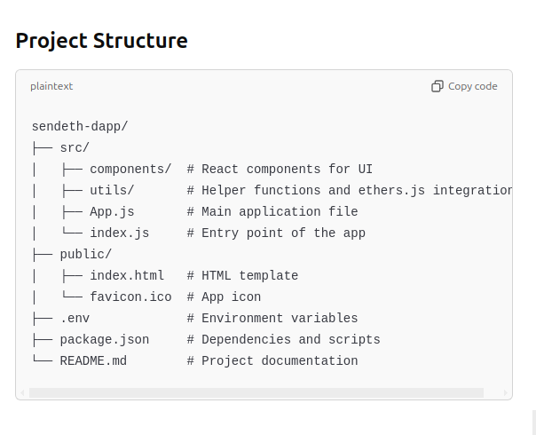

# SendETH DApp with Voting Extension on Sepolia Testnet

This is a decentralized application (DApp) built using `ethers.js` that allows users to:

1. Connect their Ethereum wallet (e.g., MetaMask).
2. View their account balance.
3. Send ETH to another address.
4. Participate in a voting process on the Sepolia Ethereum Testnet by interacting with a deployed voting smart contract.

---

## Table of Contents

- [Setup](#setup)
- [Features](#features)
- [Usage Instructions](#usage-instructions)
  - [Connecting MetaMask](#connecting-metamask)
  - [Viewing Account Balance](#viewing-account-balance)
  - [Sending ETH](#sending-eth)
  - [Casting a Vote](#casting-a-vote)
- [Project Structure](#project-structure)
- [Technologies Used](#technologies-used)
- [Notes](#notes)

---

## Setup

Follow these steps to set up the project on your local machine:

1. **Clone the Repository**

   ````bash
   git clone https://github.com/yourusername/sendeth-dapp.git
   cd sendeth-dapp ```

   ````

2. **Install Dependencies**
   Ensure you have Node.js installed. Then, install the required packages:

```bash
npm install
```

3. **Environment Variables**
   Create a .env file in the root directory with the following variable:

`REACT_APP_INFURA_KEY=<your_infura_project_id>` 4. **Run the Application**
Start the development server:

```bash
npm start
```

Open http://localhost:3000 in your browser to view the app.

---

## Features

1. **Connect MetaMask**
   Allows users to connect their Ethereum wallet using MetaMask.

2. **View Account Balance**
   Displays the ETH balance of the connected wallet.

3. **Send ETH**
   Users can input a recipient address and amount of ETH to transfer.

4. **Voting Extension**

- Cast votes for one of two proposals using the voting smart contract deployed on the Sepolia test network.
- Contract Address: `0xB2E1185468e57A801a54162F27725CbD5B0EB4a6`

---

## Usage Instructions
### Connecting MetaMask
1. Open the application in your browser.
2. Click the "Connect Wallet" button.
3. Approve the connection request in MetaMask.
4. The connected wallet address will be displayed.

### Viewing Account Balance
1. Once the wallet is connected, the balance of the connected account will automatically display in the app.
## Sending ETH
1. Enter the recipient's wallet address in the provided input field.
2. Specify the amount of ETH to send.
3. Click the "Send ETH" button.
4. Confirm the transaction in MetaMask.

### Casting a Vote
1. Select the proposal you want to vote for:
- Proposal 1: Pass an argument of 1.
- Proposal 2: Pass an argument of 2.
2. Click the "Vote" button.
3. Confirm the transaction in MetaMask.
4. Wait for confirmation of the vote transaction.

---
[]

---
## Technologies Used
- React.js: Frontend framework for building the user interface.
- Ether.js: Library for interacting with Ethereum.
- MetaMask: Browser wallet for Ethereum.
- Sepolia Testnet: Ethereum test network for development and testing.